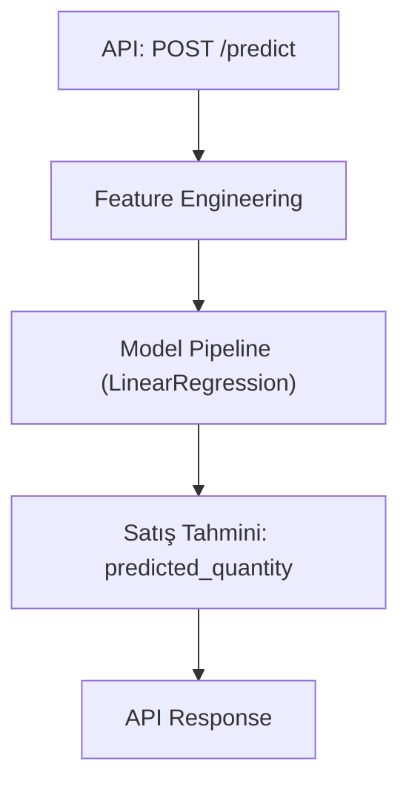
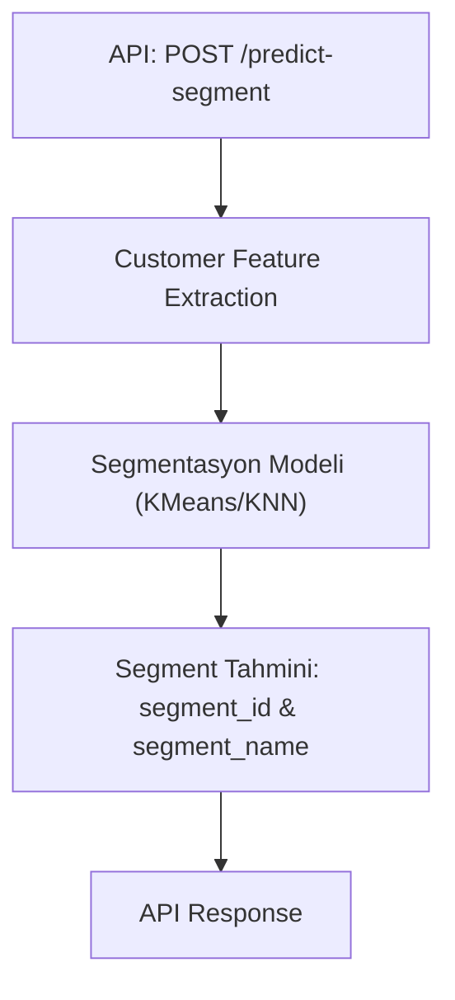

# 📐 Proje Mimarisi – ML Based Sales Prediction API

Bu doküman, "ML Based Sales Prediction API" projesinin mimari yapısını, katmanlarını, veri işleyişini ve bileşenler arası etkileşimi açıklar.

---

## 🔧 1. Teknoloji Yığını (Tech Stack)

| Katman        | Teknoloji                       |
|---------------|---------------------------------|
| Backend       | Python (FastAPI)                |
| ML Modelleme  | scikit-learn, pandas, joblib    |
| Veri Tabanı   | PosgreSQL (geliştirme), ORM ile |
| Dokümantasyon | Swagger UI, ReDoc               |
| Test Framework| Pytest                          |
| Sunucu        | Uvicorn                         |

---

## 🧱 2. Klasör Yapısı ve Katmanlar

```
📦 src/
├── api/               → FastAPI endpoint'leri
│   ├── main.py        → Uygulama giriş noktası
│   └── routes/        → Tahmin, segmentasyon, sağlık kontrolü, vs.
├── models/            → Eğitimli modeller (.pkl), ML eğitim scriptleri
├── data/              → Veri kaynakları, preprocessing scriptleri, ORM modelleri
├── utils/             → Hata yönetimi, yardımcı araçlar
├── config.py          → Ortam ve yapılandırma ayarları
```

Ek olarak:
```
📁 tests/              → Test senaryoları (API + modeller)
📁 research/           → EDA ve prototipleme (Jupyter)
📁 docs/               → API dokümantasyonu, data dictionary, mimari
```

---

## 🤖 3. ML Modelleri

### Satış Tahmin Modeli
- Tip: Regresyon (LinearRegression)
- Girdi Özellikleri (Features):
  - Tarihsel: yıl, ay, gün, günün haftası
  - Zaman serisi türevleri: lag_1-14, moving_avg_7, cumulative_sales vs.
- Çıktı: `predicted_quantity`

### 🔄 Veri Akışı – Tahmin Süreci


### Müşteri Segmentasyon Modeli
- Tip: Sınıflandırma (KMeans, KNN)
- Girdiler:
  - total_spent, num_orders, avg_order_value, num_products, recency
- Çıktı: `segment_id`, `segment_name`
- 
### 🔄 Veri Akışı – Tahmin Süreci

---

## 🧪 4. Test Mimarisi

- `tests/test_api.py`: API endpoint doğruluğu
- `tests/test_models.py`: Model çıktılarının test edilmesi
- Test Framework: `pytest`

---

## 🚀 5. Başlatma & Deployment

```bash
uvicorn api.main:app --reload --app-dir src
```

- `.env` ile yapılandırma
- Model dosyaları `saved_models/` altına kayıtlı
- JSON veya pickle (.pkl) formatında saklanır

---

## 📌 Notlar

- FastAPI + sklearn tabanlı sade ve modüler yapı
- Modeller kolayca yeniden eğitilebilir (`retrain.py`)
- Her bileşen bağımsız test edilebilir yapıdadır

---

Bu doküman, projenin sürdürülebilirliğini ve geliştirici katılımını artırmak için mimari temelleri özetlemektedir.
